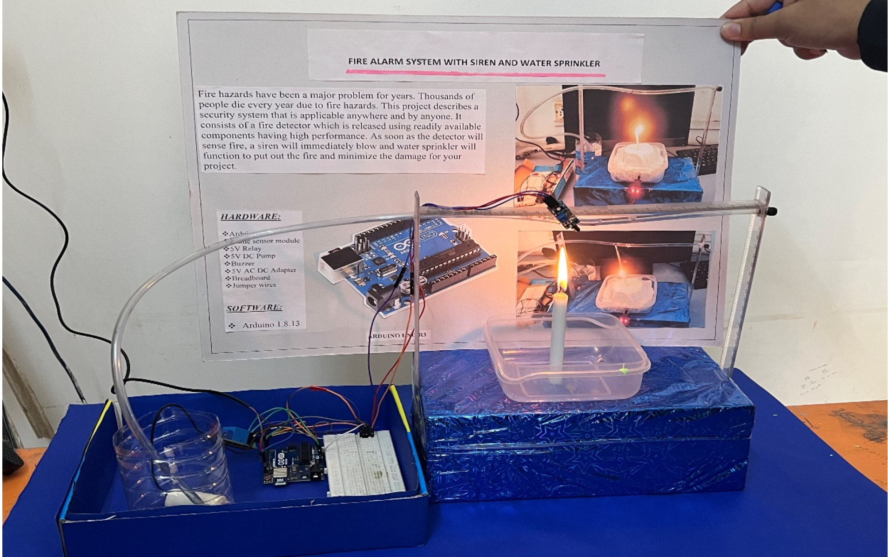

# Fire Alarm System with Automatic Water Sprinkler

## Overview

This project is an Arduino-based fire detection system that detects flames using a flame sensor. Once fire is detected, the system activates a buzzer and automatically turns on a water sprinkler after a short delay.

## Features

- Fire detection using flame sensor
- Audible alarm
- Automatic water sprinkler
- Low-cost hardware
- Arduino-based control

## Hardware

- Arduino Uno
- Flame Sensor
- Relay Module
- DC Water Pump
- Buzzer
- Breadboard
- Jumper Wires

## Software

- Arduino IDE
- Embedded C/C++

## Working

1. Flame sensor detects fire.
2. Buzzer sounds immediately.
3. After 5 seconds, the relay activates.
4. Water pump starts sprinkling water.

## Images

### Prototype

### Circuit Diagram

### Block Diagram

## Future Improvements

- GSM alerts
- Wi-Fi notifications
- Temperature sensor
- Smoke sensor
- Mobile application

## Author

Hrushikesh Pandurang Dunde
